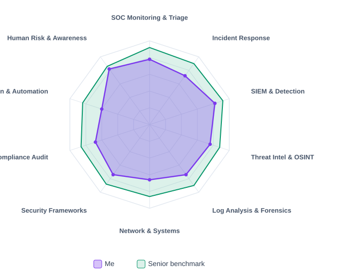

<!-- AUTO-GENERATED from resume.json — do not edit by hand. -->

<h1>Sai Kaligotla</h1>

<b>SOC Analyst (L1) · Threat Detection & Incident Response</b> Hyderabad, India

<a href="https://github.com/SaiKaligotla">GitHub</a> · <a href="https://www.linkedin.com/in/saikaligotla/">LinkedIn</a> · <a href="mailto:sarathsai94@gmail.com">sarathsai94@gmail.com</a> · +91 74163 14886

> SOC Analyst (L1) with hands-on detection & incident response — a self-built Wazuh SOC home lab, LetsDefend investigations, and log-forensics / phishing simulation work for Deloitte and Mastercard.

---

### 💼 Experience

**IT Administrator & Design Consultant**  
SansBornes Aerospace Pvt. Ltd., Bengaluru, India, Mar 2025 — Present

- Administer IT for a 15-person aerospace engineering firm: create and deprovision user accounts, enforce role-based access control and least privilege, and maintain email and web servers supporting 20+ laptops and shared drives.

- Manage the endpoint and patch lifecycle: monthly security patching plus bi-weekly system updates across 20+ endpoints, with software, hardware, and network troubleshooting as primary IT support.

- Harden the perimeter — configure company Wi-Fi and internal firewall rules — and apply access changes on every onboarding, offboarding, and role change.

- Deliver and maintain the company web platform with secure workflows and WCAG 2.1 AA accessibility; document access controls and change records for audit continuity.

- Guide engineering and design teams on compliance standards, usability guidelines, and secure system design principles during product delivery.

**UI/UX Product Designer — Behavioral Research, Systems & Compliance**  
Milathi Technologies · GoCodeDesign, Hyderabad, India, May 2024 — Feb 2025

- Founded Milathi's design language and built the company-wide design system — reusable components, standards, and documentation used across app, web, and marketing — and led the product from concept to launch.

- Managed 3 concurrent product projects at GoCodeDesign (finance, medical, e-commerce apps), delivering on time and in scope while enforcing consistent standards across teams.

- Ran user research and usability testing to expose where users misread warnings, skip steps, or bypass intended flows — the failure modes behind phishing clicks and insider missteps.

- Partnered with developers end-to-end to ship production-ready, WCAG 2.1 AA accessible interfaces and governed design consistency across all product surfaces.

**Experience Design Associate — Human Factors & Operational Workflows**  
Tim Hortons, Ontario, Canada, Jul 2022 — Feb 2024

- Observed and analyzed real user behavior on the floor, documenting how customers and crew work around intended processes under time pressure — the same bypass behavior behind security-control and policy violations.

- Redesigned service workflows with store leadership to remove error-prone steps, adding visual cues and verification touchpoints that reduced ordering errors.

- Applied human-centered analysis to daily operations and proposed process improvements to leadership that shaped future service design standards.

**Product & Web Designer — Delivery Discipline & Cross-Team Coordination**  
Ushakiron Movies Pvt. Ltd. · EGEE Pallet Pvt. Ltd., Hyderabad, India, Dec 2020 — Jun 2022

- Delivered 30+ multidisciplinary projects (branding, web, print) at EGEE Pallet with 100% on-time completion and strong client feedback; designed and launched website layouts and UI components.

- Introduced a new design workflow and file-management system that reduced project turnaround and improved handoff quality between content, marketing, and production teams.

- Ran market and user research with marketing leadership at Ushakiron to align product and campaign direction with audience insight, and delivered cohesive brand assets across print, web, and digital.

**Product Designer (Freelance)**  
Upwork — International Clients, Remote, May 2017 — Jan 2020

- Delivered 50+ cross-disciplinary projects (brand identity, illustration, web) for international clients with a 4.9/5 average rating and 98% satisfaction — structured discovery, requirements alignment, delivery, and follow-up.

- Built brand identity systems and websites from brief to launch; standardized workflows across Adobe Creative Suite, Figma, and Webflow for consistent, repeatable delivery.

**E-Learning Animator · Production Designer · Animation Intern**  
Mind Map Consulting (Meta, Microsoft, Wipro) · Vaaraahi Chalana Chitram · Ad.FX, Hyderabad, India, Jun 2016 — Feb 2017

- Produced end-to-end animated learning modules and interactive guides for global corporate clients (Meta, Microsoft, Wipro), translating complex technical content into clear, structured visual narratives — directly applicable to security-awareness training design.

- Contributed storyboards, concept art, and 3D animation to feature-film and commercial pipelines, working directly with directors, writers, and client teams to deliver against briefs.

---

### 📊 Skills Benchmark

_Skills vs. senior SOC Analyst benchmark — Me vs. Senior benchmark._

  

### 🛠️ Skills

**Security Operations**  
`SOC analysis`, `alert triage & escalation`, `threat hunting`, `phishing investigation`, `incident response`, `vulnerability assessment`, `multi-source log correlation`, `MITRE ATT&CK mapping`, `SIEM`

**Incident Response & Containment**  
`EDR host isolation`, `credential response & session revocation`, `perimeter IP blocking`, `false-positive elimination`, `evidence-based verdicts`, `post-incident reporting`, `IoC documentation`

**Threat Intelligence & OSINT**  
`VirusTotal`, `ANY.RUN sandbox`, `Hybrid Analysis`, `URLScan`, `URLhaus`, `AbuseIPDB`, `phishing & IoC enrichment`, `indicator classification`

**Network & Systems**  
`TCP/IP`, `firewall & Wi-Fi security`, `Windows & Linux administration`, `Active Directory`, `patch management`, `VirtualBox networking`, `identity & access management (RBAC, least privilege, MFA)`

**Frameworks & Compliance**  
`NIST CSF`, `NIST RMF`, `PCI DSS`, `GDPR`, `SOC 2`, `WCAG 2.1 AA accessibility`, `audit documentation`

**Tools**  
`Wazuh (SIEM/EDR)`, `Kali Linux`, `Hydra`, `Nmap`, `LetsDefend`, `Splunk (training)`, `Wireshark (training)`, `Bash`, `SQL`, `Git/GitHub`, `Google Workspace admin`

**Human Risk & Analytics**  
`UEBA fundamentals`, `insider threat & phishing behavior analysis`, `security awareness training design`, `user research & usability testing`, `dashboard usability / alert-fatigue reduction`

---

### 🚀 Projects

_13 public repositories — populated automatically from GitHub._

#### [SOC Home Lab — Threat Simulation, Detection & Incident Response (Wazuh)](https://github.com/SaiKaligotla/SOC-Home-Lab-Wazuh) · Personal lab (VirtualBox: Kali + Ubuntu + Wazuh) · 2026
- Architected a fully isolated 3-VM SOC lab on VirtualBox (32 GB / 8-core host): custom NAT network (10.0.2.0/24) with localhost-only port forwarding (127.0.0.1:8443 → 10.0.2.7:443) so the SIEM never touches the production network.
- Deployed Ubuntu Server 22.04 LTS target (OpenSSH + Wazuh agent) and verified the live telemetry pipeline into the Wazuh manager / indexer / dashboard stack.
- Executed Hydra SSH brute force with a control vs. escalation method: validated a single-failure baseline (correctly stayed under the correlation threshold), then ran a 4-thread dictionary attack (fasttrack) — 262 login attempts in under 15 seconds.
- Triaged in the Wazuh dashboard as a SOC analyst: scoped the authentication event-volume spike, distinguished atomic rule 5710 (L5) from correlated rule 5712 (L10), and mapped detections to MITRE ATT&CK T1110 (Brute Force).
- Extracted IoCs from raw alert JSON (data.srcip, data.dstuser, system_name, rule.mitre.id) and reconstructed the full incident narrative — attacker, target account, affected endpoint, and technique — for escalation and remediation.
- Documented the complete lifecycle — infrastructure, attack simulation, detection analysis, and key takeaways — with screenshots, in a public write-up.

#### [SOC Incident Response Case Files (LetsDefend)](https://github.com/SaiKaligotla/SOC-Incident-Response-Case-Files) · 4 investigations in an enterprise SOC simulation · 2026
- Investigated 4 live-simulated alerts in LetsDefend's enterprise SOC environment — 3 true positives, 1 false positive — each documented as an Official Incident Report.
- Phishing (EventID 257 / SOC282): deceptive email delivering AsyncRAT — pivoted email gateway, proxy, and endpoint logs; verified indicators via OSINT (VirusTotal, ANY.RUN, URLScan, URLhaus).
- Endpoint (EventID 44 / SOC113): suspicious hh.exe usage (LOLBin, T1218.001) — reconstructed process lineage and ruled it a false positive, documenting the investigative misstep honestly.
- Network & identity (EventID 225 / SOC257 unauthorized-country VPN; EventID 303 / SOC325 unauthorized cloud region): confirmed credential abuse and brute-force attempts, both blocked by existing MFA/firewall controls; documented containment (credential resets, session revocation, IP blocking, EDR isolation).
- Applied a repeatable 7-step IR methodology — alert triage, multi-source log correlation (proxy, firewall, VPN, email, EDR, authentication), hypothesis-driven analysis, containment, lesson learned, remediation, and a MITRE ATT&CK appendix (T1566, T1204, T1218.001, T1133, T1595, T1078, T1621).

#### [Incident Investigation: Web Log Forensics & Data Exfiltration (Deloitte)](https://github.com/SaiKaligotla/Deloitte-Intranet-Data-Breach-Analysis) · Deloitte Cyber Job Simulation (Forage) · 2026
- Conducted forensic analysis on intranet HTTP web-request logs to confirm a suspected data leak; traced an automated exfiltration script polling internal APIs every 60 minutes from one compromised user account and static internal IP.
- Isolated Indicators of Compromise (IoCs) — compromised user ID, source IP, and query pattern — and recommended immediate credential revocation, enforced MFA, and a SIEM alert rule on anomalous API polling.
- Delivered the full detection → analysis → containment → recommendation chain as a handover-ready incident report with a clear remediation timeline.

#### [Enterprise Phishing Simulation & Human-Risk Analysis (Mastercard)](https://github.com/SaiKaligotla/Mastercard-Cybersecurity-Simulation-Forage) · Mastercard Cybersecurity Job Simulation (Forage) · 2026
- Designed and executed a simulated phishing campaign targeting internal credentials across 7 corporate departments to benchmark social-engineering susceptibility.
- Aggregated and ranked click and credential-submission metrics, identifying critical human-risk exposure in HR (75% compromise rate) and Marketing (38% compromise rate).
- Built and delivered a targeted remediation training deck — hyperlink inspection, sender/source verification, out-of-band confirmation — addressing the exact click vectors exposed, with repeat-testing follow-ups to measure improvement.

#### [Security Audit & Compliance Assessment (NIST CSF, PCI DSS, GDPR)](https://github.com/SaiKaligotla/botium-toys-security-audit) · Botium Toys · Google Cybersecurity Labs · 2026
- Audited 25+ controls across assets, access control, backup, and incident planning against the NIST CSF; produced a risk-graded control assessment (least privilege, IDS, encryption, backups, DR, separation of duties, centralized password management).
- Mapped each gap to PCI DSS cardholder-data requirements, GDPR privacy obligations (72-hour breach notification, data classification), and SOC 1/2 control expectations.
- Delivered prioritized remediation recommendations and a revised asset inventory to close the highest-risk findings first.

#### [SOC Lab: SQL Security Investigation — Log Analysis & Asset Tracking](https://github.com/SaiKaligotla/SQL-Security-Investigation-Log-Analysis-Asset-Tracking) · Google Cybersecurity Labs · 2026
- Queried the log_in_attempts database to isolate failed logins after 18:00 — the after-hours pattern consistent with brute force and password-spray attacks.
- Built an incident-response timeline by correlating login activity across the suspected compromise window (May 8–9), mapping authentication attempts by geographic location using LIKE filters.
- Identified employee endpoints requiring urgent security updates by joining employee, office, and machine data, then documented the patch status for remediation.

#### [SOC Lab: Linux File Permissions & Access Control Remediation](https://github.com/SaiKaligotla/Linux-File-Permissions-Management) · Google Cybersecurity Labs · 2026
- Audited a Linux file system with ls -la, analyzing 10-character permission strings to establish a baseline of who could access what.
- Remediated policy violations: revoked world-writable access (chmod o-w) to stop unauthorized modification and locked a hidden archive file read-only (chmod u-w,g-w) to preserve its integrity.
- Isolated a restricted research directory to owner-only access (chmod u=rwx,g=,o=), containing access and preventing lateral movement across shared projects.

#### [Incident Handler's Journal: Ransomware Outbreak](https://github.com/SaiKaligotla/Incident-Handler-s-Journal-Ransomware-Outbreak) · Incident response · 2026
- Step-by-step incident handler's journal for a simulated ransomware outbreak — documenting detection, containment, eradication, and recovery.

#### [Python Access Control Algorithm](https://github.com/SaiKaligotla/Python-Access-Control-Algorithm) · Hands-on project
- Python implementation of an access-control algorithm enforcing role-based checks.

#### [Cyberpulse — Security & Hacker News Bot](https://github.com/SaiKaligotla/Cyberpulse) · Python
- Bot that scrapes the internet for cybersecurity and hacker news.

#### [Cyberkit — Cybersecurity Utility Toolkit](https://github.com/SaiKaligotla/Cyberkit) · Python
- Modular Python toolkit of cybersecurity utilities.

#### [NIST SP 800-30 Risk Analysis](https://github.com/SaiKaligotla/NIST-SP800-30-Risk-Analysis) · Risk management
- Risk assessment mapped to the NIST SP 800-30 risk management framework.

#### [NIST CSF DoS Incident Response](https://github.com/SaiKaligotla/NIST-CSF-DoS-Incident-Response) · Incident response
- Denial-of-Service incident response aligned to the NIST Cybersecurity Framework.

---

### 🎓 Certifications

- Google Cybersecurity Professional Certificate — Coursera (2026)
- LetsDefend SOC Analyst — 30+ alerts investigated · 4 incident case files
- TryHackMe — SOC Level 1
- Mastercard Cybersecurity Job Simulation — Forage (2026)
- Deloitte Cyber Job Simulation — Forage (2026)

### 📚 Education

**MBA, Marketing**  
Andhra University, Visakhapatnam, India · Expected 2027

**Post-Graduate Certificates — Visual Effects & Editing (2020) · 3D Animation & Character Design (2019)**  
Fanshawe College, London, Canada · 2018 – 2020

**Bachelor of Fine Arts (B.F.A.), Animation**  
Jawaharlal Nehru Architecture & Fine Arts University (JNAFAU), Hyderabad, India · 2012 – 2016

### 🎯 Details

**Target roles:** SOC Analyst L1 · Security Analyst · Trust & Safety Analyst

**Availability:** Immediate joiner

**Languages:** English (full professional) · Telugu (native) · Hindi (limited working)

---

<i>Rendered from <code>resume.json</code> on 2026-09-02. Edit the JSON (or push new repos) and this updates automatically.</i>

